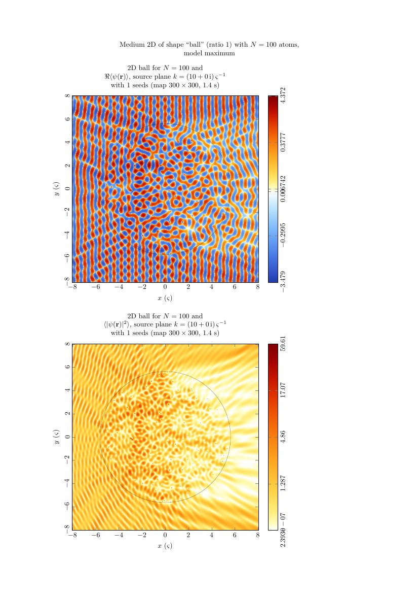

# MSModel

* [PRESENTATION](#presentation)
* [INSTALLATION](#installation)
	- [Dependencies](#dependencies)
	- [Installation guide](#installation-guide)
* [USAGE AND OPTIONS](#usage-and-options)
	- [msmain](#msmain)
	- [msplot](#msplot)
* [CONFIGURATION FILE](#configuration-file)
	- [medium](#medium)
	- [complex map](#complex-map)
	- [complex cut](#complex-cut)
	- [logarithmic cut](#logarithmic-cut)
	- [complex histogram](#complex-histogram)
	- [imaginary histogram](#imaginary-histogram)
	- [wavefunction](#wavefunction)
	- [differential cross section](#differential-cross-section)
	- [random function](#random-function)
	- [eigenstate list](#eigenstate-list)
* [EXAMPLE](#example)

## PRESENTATION 

MSModel is a program written in C for solving multiple-scattering problems of scalar waves in disordered media made of point scatterers.
It was developed by David Gaspard for his doctoral thesis mainly between July 2020 and April 2021.
This programs implements the Foldy-Lax model, which assumes that the scatterings of the wave with the point-like scatterers involve only spherical waves ($s$-waves).
This model has the advantage that it can be generalized to an arbitrary number of spatial dimensions: $d=1,2,3,4,\ldots$.
In this model, one considers $N$ point scatterers located at positions <tspan>$\mathbf{x}_1,\mathbf{x}_2,\ldots,\mathbf{x}_N$</tspan> and a quantum spinless particle of wavenumber $k=||\mathbf{k}||$.
The wavefunction of the particle can be expressed as

<p>$$\psi(k,\mathbf{r}) = \phi(k,\mathbf{r}) + \sum_{i=1}^N a_i G^+(k,\mathbf{r}\mid\mathbf{x}_i)$$</p>

where $\phi(k,\mathbf{r})$ is the incident wavefunction, which is typically but not necessarily a plane wave $\mathrm{e}^{\mathrm{i}\mathbf{k}\cdot\mathbf{r}}$, and $G^+(k,\mathbf{r}\mid\mathbf{x}_i)$ denotes the (outgoing) Green function corresponding to the free propagation of the particle from point $\mathbf{x}_i$ to point $\mathbf{r}$.
The amplitudes $a_i\in\mathbb{C}$ $\forall i\in\{1,\ldots,N\}$ on all the scattering sites are given by the Foldy-Lax linear system of equations, which reads

<p>$$\mathsf{M}(k)\cdot\mathbf{a} = \boldsymbol{\phi}$$</p>

where $\mathbf{a}=(a_1,\ldots,a_N)$ and $\boldsymbol{\phi}=(\phi(k,\mathbf{x}_1),\ldots,\phi(k,\mathbf{x}_N))$ are column vectors containing the amplitudes and the incident waves on the scattering sites, respectively.
The notation $\mathsf{M}(k)$ stands for the multiple-scattering matrix, whose elements are

<p>$$M_{ij}(k) = F(k)^{-1} \delta_{ij} - G^+(k,\mathbf{x}_i\mid\mathbf{x}_j) (1-\delta_{ij})$$</p>

where $F(k)$ is the scattering amplitude.
There are special values of $k\in\mathbb{C}$ for which the Foldy-Lax system has no solution.
These values correspond to _resonances_ of the system, and are given by the determinantal equation:

<p>$$\det\mathsf{M}(k) = 0$$</p>

In general, this determinantal equation cannot be cast into a simple eigenvalue problem, hence the need for a numerical implementation.

In this framework, the two main purposes of the MSModel program are:

* solving the Foldy-Lax linear system and showing the wavefunction,
* finding the resonances of the system, i.e., the values of $k\in\mathbb{C}$ which satisfy the determinantal equation above.

More details on the mathematical methods are available in the following papers:

* David Gaspard and Jean-Marc Sparenberg, [Phys. Rev. A **105**, 042204 (2022)](https://doi.org/10.1103/PhysRevA.105.042204).
* David Gaspard and Jean-Marc Sparenberg, [Phys. Rev. A **105**, 042205 (2022)](https://doi.org/10.1103/PhysRevA.105.042205).

Some results obtained with the present program were published in these papers.

## INSTALLATION

### Dependencies

MSModel has only been tested on Linux systems and especially Ubuntu 20+, but it should work on other Linux distributions too.
MSModel requires the GCC compiler (with the `-fms-extensions` option available), but also LAPACK, and OpenMP to compile properly.
In addition, upon execution, this program calls external UNIX commands including `file`, `which`, `rm`, `pnmtopng`, `lualatex`, `pdfcrop`.

* `pnmtopng` is needed to convert PNM images to (lighter) PNG images.
* `lualatex` is needed to compile TikZ/PGFPlots graphics to PDF.
* `pdfcrop` is an optional command to crop PDF generated in LaTeX.

### Installation guide

To install MSModel, the recommended way is to clone the present repository to your own machine.
For this purpose, make sure `git` is installed on your machine entering `git --version` in a terminal.
If this command does not work, then install `git` using
```
sudo apt install git
```
or any other package manager.
Now, type the following commands:
```
git clone <url>
```
where `<url>` should be replaced by the GitHub URL of this repository (see the `Code` button in the top-right corner).
After the download is completed, `cd` to the new `msmodel` directory and compile the sources using:
```
make all
```
If everything works properly, you should see a new `bin/` directory with the object files and two executables `msmain` and `msplot`.
Additional test executables can be compiled using `make test`.
To remove all the binary files of the program, enter `make clean`.
This last command is more generally useful when there are changes to the code.

## USAGE AND OPTIONS
MSModel comes with two main executables, namely `msmain` and `msplot`.

### msmain
The syntax of `msmain` reads:
```
msmain [options] file1.conf [file2.conf ...]
```
This program parses the given configuration files and executes the computation according to the instructions therein.
See section [Configuration file](#configuration-file) here below for more details on the syntax of the configuration files.
The output of the computation are written to a new configuration file of the same format, which is written to the path:
```
out/d<d>/<shape>/<scmodel>/n<n>_<uid>.dat
```
relative to the execution directory.
In the path here above, the notations are (see also the [medium specifications](#medium) below):
* `<d>` is the number of dimensions set in the initial configuration file,
* `<shape>` is the shape of the region where point scatterers are randomly placed,
* `<scmodel>` is the scattering model used,
* `<n>` is the total number of scatterers, and
* `<uid>` is a unique identifier based on the current time (updated every millisecond).

The options of `msmain` are the following:
* `-p <nthread>`: Set the number of threads to `<nthread>` for the parallelization. The default value is 4. In general, the recommended value is the number of physical cores of the processor. Higher values are also possible on [hyper-threaded processors](https://en.wikipedia.org/wiki/Hyper-threading), but the speedup may not be significant.
* `-?`: Print a short command summary and exits.

### msplot
Similar to `msmain`, the syntax of `msplot` reads:
```
msplot [options] file1.dat [file2.dat ...]
```
This program parses the configuration files generated by `msmain` and tries to display the results of the computations in a PDF file using the famous TikZ package of LaTeX.
The separation of the functionalities of MSModel into `msmain` and `msplot` is motivated by the fact that the computations performed by `msmain` generally take a much longer time than the rendering made by `msplot`.
In this way, the user can plot the same data multiple times, tuning the different options, without having to start the entire computation again each time.

The options of `msplot` are the following:
* `-k`: Keep the temporary PNG and TikZ files which are deleted by default.
* `-c`: Crop the final PDF file using `pdfcrop`.
* `-m <seed>`: Display the random configuration of the point scatterers for the given `<seed>`. The `<seed>` must be positive and not zero.
* `-l`: Take the Laplacian of [complex maps](#complex-map), [complex cuts](#complex-cut), or [logarithmic cuts](#logarithmic-cut), hence showing the resonance density. This option is only relevant for `*.dat` files containing [complex maps](#complex-map), [complex cuts](#complex-cut), or [logarithmic cuts](#logarithmic-cut).
* `-x <real>`: Display a vertical cut of the [complex map](#complex-map) at the given real part `<real>`. This option only applies to [complex maps](#complex-map). However, note that it is a deprecated option. Indeed, it is more appropriate and efficient to compute a vertical cut using the [complex cut](#complex-cut) or even the [logarithmic cut](#logarithmic-cut) utilities.
* `-r <lmax>`: Compute and display the resonances predicted by the effective square well approximation assuming a spherical medium. `<lmax>` is the maximum number of partial waves considered in the calculation. This option only applies to [complex maps](#complex-map).
* `-t`: Use logarithmic scale to draw the $\theta$ angle of the differential cross section. This option is only relevant for `*.dat` files containing [differential cross section](#differential-cross-section) data. By default, the angle of the differential cross section is plotted in linear scale.
* `-?`: Print a short command summary and exits.

## CONFIGURATION FILE
A configuration file consists of a certain number of sections which typically represent simulation commands.
Each section contains a bunch of key/value options in the format `key=value`.
Comments can be inserted in configuration files with the usual character `#`. All commented lines will be ignored by the program.
See also the `input.conf` example file located in the root directory of the project.
Configuration files are typically given as input to `msmain`.
The output file generated by `msmain` also uses the syntax of configuration files, but it includes the results of the computation usually consisting of an entry `data` with the raw data and an entry `realtime` with the computation time.
This output file can then be given as input to `msplot` to generate plots, or to `msmain` to start the computation again with the same parameters.

The details of the many options that can be used in configuration files are listed here below.

### medium
Each valid configuration file must begin with a section titled `[medium]` and followed by mandatory lines containing the options.
It should be noted that the unit length of the program, which is denoted as `sp` or $\varsigma$, is the mean inter-scatterer distance between nearest neighbors.
Therefore, the unit of the wavenumber (including the complex wavenumber) will be `1/sp` or $1/\varsigma$.

The options are the following:
* `dimension`: Number of spatial dimensions of the physical space in which the scatterers are placed. It must be a nonzero positive integer less than 20.
* `natom`: Total number of scatterers in the medium. It must be a nonzero positive integer less than 50000 for safety reasons.
* `model`: Model of point scattering. It is either `hardsphere <alpha>`, `softsphere <alpha>`, `resonant <real> <imag>`, or `maximum`. The parameter `<alpha>` is the scattering length in unit of $\varsigma$, and `<real> <imag>` is the position of the resonance pole in units of $1/\varsigma$. Regarding the hard-sphere model, one should keep in mind that the cross section of the individual scatterers vanishes when $\alpha k$ matches a zero of the Bessel function $J_{\frac{d-2}{2}}(\alpha k)$. This can produce a strong singularity in the complex plane. Therefore, one should restrict the exploration region to $|\alpha k| < j_{\frac{d-2}{2}}$, where $j_\nu$ is the first nontrivial zero of the Bessel function $J_\nu(z)$.
* `shape`: Shape or type of the medium in which the scatterers are placed. It is either `cube`, `ball`, `lattice`, or `gaussian`. It should be noted that `ball` is automatically converted to `cube` by the program in one dimension. The density of the medium is kept equal to $1/\varsigma^d$ by definition of $\varsigma$.
* `ratio`: Aspect ratio, or elongation, of the medium. The deformation preserves the unitary density of the medium. The value `ratio=1` corresponds to the absence of deformation. Used to increase the upper limit on scatterer-scatterer distances.

### complex map
Complex map commands are declared by the section title `[kplane]` in the configuration file.
The speciality of MSModel is the plotting of complex maps.
The complex map command evaluates the _characteristic function_

<p>$$\chi(k) = \ln\det\mathsf{M}(k)$$</p>

in a given rectangular region of the complex plane of $k$.
The Laplacian of the real part of this function yields the two-dimensional resonance density at the given point $k\in\mathbb{C}$ according to:

<p>$$\rho^{(2)}(k) = \frac{1}{2\pi}\left(\frac{\partial^2}{\partial k_r^2} + \frac{\partial^2}{\partial k_i^2}\right)\mathrm{Re}\,\chi(k)$$</p>

See also the paper [Phys. Rev. A **105**, 042205 (2022)](https://doi.org/10.1103/PhysRevA.105.042205) with more details on this method.
The complex map command is able to average the characteristic function over a certain number of random configurations of the scatterers.

The options are the following:
* `nseed`: Number of configurations of the scatterers, or seeds, that will be averaged.
* `xrange`: Horizontal range of the complex map in the $k$-plane (units of $1/\varsigma$). The format is `<xmin>:<xmax>`.
* `yrange`: Vertical range of the complex map in the $k$-plane (units of $1/\varsigma$). The format is `<ymin>:<ymax>`.
* `xsample`: Horizontal number of samples or pixels. Larger values needs more computation time. A good trade-off is between 150 and 300.
* `ysample`: Vertical number of samples or pixels. Note that this argument is optional. If not given, it will be deduced by the program in order to keep the pixel aspect ratio as close to 1 as possible.
* `color`: Parameters of the coloring scheme. The format is `<scheme> <type> <contrast> [rev]`.
	- The `<scheme>` is either `temperature`, `magma`, `hesperia`, `viridis`, `parula`. The `temperature` scheme is recommended.
	These color schemes are inspired by the colormaps developed by Stefan van der Walt and Nathaniel Smith for Matplotlib (see [their work](https://bids.github.io/colormap/)).
	- The `<type>` is either `seq` for sequential, or `div` for diverging from zero.
	- The `<contrast>` parameter controls the contrast. The value 5 gives acceptable results for most purposes.
	- Optionally, the flag `rev` can be added at the end to reverse the color scheme.
* `title`: Give a short custom title to the simulation in less than 80 characters.

### complex cut
Complex cuts are declared by the section title `[kcut]` in the configuration file.
The principle of complex cuts is analogous to [complex maps](#complex-map), but it restricts the evaluation of the characteristic function to a straight line in the complex plane of $k$.
This is particularly useful to save computation time so as to increase the number of random configuration over which the characteristic function is averaged.
With this command, the samples are now evaluated in a $(n+2)\times 3$ bitmap in order to evaluate the discrete Laplacian on the cut itself.

The options are the following:
* `nseed`: Number of configurations of the scatterers, or seeds, that will be averaged.
* `kmin`: Start point of the straight cut. The format is `<real><imag>i` using the sign of `<imag>` as the separator.
* `kmax`: End point of the straight cut. The format is the same as for `kmin`.
* `sample`: Number of samples along the straight cut. Typically between 10 and 100. The value can be reduced to mitigate the fluctuations.
* `title`: Give a short custom title to the simulation in less than 80 characters.

### logarithmic cut
Logarithmic cuts are declared by the section title `[logkcut]` in the configuration file.
The principle of logarithmic cuts is very similar to [complex cuts](#complex-cut). The three differences are:
* The samples are taken on a logarithmic scale to better probe the region close to the real axis.
* The straight cut is necessarily vertical, i.e., for a fixed value of the real part, $\mathrm{Re}(k)$, which is not the case with complex cuts.
* The samples are taken only on the cut and not in the vicinity so as to compute the Laplacian. Instead, the second derivative in the direction of the real axis is _supposed_ to be equal to zero. This is an approximation based on empirical observations in the region of large wavenumber, that is $k\varsigma\gg j_{\frac{d-2}{2}}$, where $j_\nu$ is the first nontrivial zero of the Bessel function $J_\nu(z)$.

The options are the following:
* `nseed`: Number of configurations of the scatterers, or seeds, that will be averaged.
* `rek`: Real part of the wave number, i.e., horizontal position of the logarithmic cut.
* `imkmin`: Imaginary part of $k$ closest to the real axis. The point on the real axis is the asymptotic point of the logarithmic mesh.
* `imkmax`: Imaginary part of $k$ farthest from the real axis. The two values `imkmin` and `imkmax` must be negative.
* `sample`: Number of samples along the cut. Typically between 10 and 100. The value can be reduced to mitigate the fluctuations.
* `title`: Give a short custom title to the simulation in less than 80 characters.

### complex histogram
Complex histograms are declared by the section title `[muplane]` in the configuration file.
Complex histograms are histograms of the complex eigenvalues of either the multiple-scattering matrix, $\mathsf{M}(k)$, or its normalized version

<p>$$N_{ij}(k) = \mathrm{i}\delta_{ij} - \frac{G^+(k,\mathbf{x}_i\mid\mathbf{x}_j)}{I(k,0)}(1-\delta_{ij})$$</p>

where $I(k,0)=-\mathrm{Im}G^+(k,0)$ is the (unnormalized) density of free states which is a regular function of $k$.
The distribution of eigenvalues is computed for a given value of $k$ (possibly complex).
Additionally, complex histograms determine the marginal distribution of the imaginary part of the eigenvalues, but not the real part.

The options are the following:
* `mtype`: Type of the matrix for which the eigenvalues are computed. Either `msmatrix` for $\mathsf{M}(k)$, or `normalized` for the model-independent version $\mathsf{N}(k)$.
* `k`: Wavenumber at which the matrix is computed. The format is `<real><imag>i` using the sign of `<imag>` as the separator.
* `nseed`: Number of configurations of the scatterers, or seeds, that will be averaged.
* `xbin`: Horizontal number of bins of the rectangular region of the complex plane.
* `ybin`: Vertical number of bins of the rectangular region of the complex plane.
* `mbin`: Number of bins used for the marginal distribution of the imaginary parts of the eigenvalues.
* `xrange`: Horizontal range of the complex plane in the format `<xmin>:<xmax>`. This is optional, because it can be more or less estimated from the first eigenvalues.
* `yrange`: Vertical range of the complex plane in the format `<ymin>:<ymax>`. This is optional, because it can be more or less estimated from the first eigenvalues.
* `mrange`: Range of the marginal distribution in the format `<mmin>:<mmax>`. This is optional, because it can be more or less estimated from the first eigenvalues.
* `color`: Same option as for [complex maps](#complex-map).
* `title`: Give a short custom title to the simulation in less than 80 characters.

### imaginary histogram
Imaginary histograms are declared by the section title `[imag_mu]` in the configuration file.
The principle is very similar to [complex histograms](#complex-histogram) but restricted to the marginal distribution of the imaginary parts of the eigenvalues of $\mathsf{M}(k)$ for a given value of $k$ (only real).

The options are the following:
* `k`: Wavenumber at which the matrix is computed. The value must be real.
* `nseed`: Number of configurations of the scatterers, or seeds, that will be averaged.
* `nbin`: Number of bins used for the histogram. Reduce the value to get smoother histograms.
* `title`: Give a short custom title to the simulation in less than 80 characters.

### wavefunction
Wavefunction plots are declared by the section title `[wavefunction]` in the configuration file.
Wavefunction plots consists in the representation of a two-dimensional cut in the $xy$ plane of both the real part of the wavefunction, $\mathrm{Re}\psi(k,\mathbf{r})$, and its square modulus, $|\psi(k,\mathbf{r})|^2$, for a given incident wave $\phi(k,\mathbf{r})$, that may be plane or spherical.
Plane waves are necessarily in the direction of the $x$ axis, and spherical waves are necessarily located at the center of the medium.
The command allow the wavefunction (and its square modulus) to be averaged over a certain number of random configurations of the scatterers.

The options are the following:
* `nseed`: Number of configurations of the scatterers, or seeds, that will be averaged. To disable averaging, simply use `nseed=1`.
* `iseed`: Index of the first used seed (included). This option is typically useful only when `nseed=1`.
* `k`: Wavenumber of the incident wave (possibly complex). The format is `<real><imag>i` using the sign of `<imag>` as the separator.
* `source`: Type of incident wave, either `plane` or `spherical`.
* `nx`: Number of horizontal pixels used to render the wavefunction.
* `ny`: Number of vertical pixels used to render the wavefunction.
* `xrange`: Horizontal range of the region to be rendered in position space (in $\varsigma$). This should be estimated by the user from the size of the medium.
* `yrange`: Vertical range of the region to be rendered in position space (in $\varsigma$). This should be estimated by the user from the size of the medium.
* `color1`: Color scheme used for the averaged wavefunction. See also the `color` option of [complex maps](#complex-map) for details of the syntax.
* `color2`: Color scheme used for the averaged square modulus of the wavefunction, i.e., the density. Same syntax as `color1`.

### wavefunction cut
Wavefunction cuts are declared by the section title `[wavefunction_cut]` in the configuration file.
The principle is very similar to [wavefunction plots](#wavefunction) as it represents both $\mathrm{Re}\psi(k,\mathbf{r})$ and $|\psi(k,\mathbf{r})|^2$, but it restricts the scope to a straight cut along the $x$ axis, whichever the number of spatial dimensions.
In addition, this command is able to show the quartiles of the distribution of the ordinates of $\mathrm{Re}\psi(k,\mathbf{r})$ and $|\psi(k,\mathbf{r})|^2$.

The options are the following :
* `nseed`: Number of configurations of the scatterers, or seeds, that will be averaged. To disable averaging, simply use `nseed=1`.
* `iseed`: Index of the first used seed (included). This option is typically useful only when `nseed=1`.
* `k`: Wavenumber of the incident wave (possibly complex). The format is `<real><imag>i` using the sign of `<imag>` as the separator.
* `source`: Type of incident wave, either `plane` or `spherical`.
* `nbin`: Number of evaluation points used to render the wavefunction.
* `xrange`: Horizontal range of the region to be rendered in position space (in $\varsigma$). This should be estimated by the user from the size of the medium.

### differential cross section
Plots of the differential cross section are declared by the section title `[diff_cross_section]` in the configuration file.
This command evaluates the angular differential cross section of the random medium in the $xy$ plane using the formula

<p>$$\frac{\mathrm{d}\sigma}{\mathrm{d}\Omega}(k,\boldsymbol{\Omega}) = \frac{I(k,0)}{kS_d} |T(k,\boldsymbol{\Omega})|^2$$</p>

where the function $T$ is given by

<p>$$T(k,\boldsymbol{\Omega}) = \sum_{i=1}^N a_i \mathrm{e}^{-\mathrm{i}k\boldsymbol{\Omega}\cdot\mathbf{x}_i}$$</p>

The command is able to average over the random configurations of the scatterers, to show the quartiles of the distribution of the ordinates of the differential cross section, and to plot a certain number of samples of the differential cross section for specific seeds.

The options are the following :
* `nseed`: Number of configurations of the scatterers, or seeds, that will be averaged. To disable averaging, simply use `nseed=1`.
* `iseed`: Index of the first used seed (included).
* `k`: Wavenumber at which the differential cross section is computed. The value must be real.
* `nbin`: Number of bins (or evaluation points) of the differential cross section.
* `thmin`: Minimum angle at which the differential cross section will be evaluated (in degrees). The typical value is 1.
* `thmax`: Maximum angle at which the differential cross section will be evaluated (in degrees). The typical value is 180.
* `nq`: Number of quantiles to represent the statistical distribution of the differential cross section in each bin. The recommended value is 5.
* `nc`: Number of sample curves to plot in the separate panel. The recommended value is 3.
* `title`: Give a short custom title to the simulation in less than 80 characters.

### random function
Plots of random functions are declared by the section title `[random_function]` in the configuration file.
A random function is either the total cross section $\sigma(k)$, or the variation of the density of states (DOS) due to the presence of the scatterers.
The total cross section is defined as the integral of the differential cross section:

<p>$$\sigma(k) = \oint_{\mathcal{S}_d} \mathrm{d}\Omega \frac{\mathrm{d}\sigma}{\mathrm{d}\Omega}(k,\boldsymbol{\Omega})$$</p>

The variation of density of states is defined as:

<p>$$\Delta\mathcal{D}(k^2) = -\frac{1}{\pi} \mathrm{Im}\,\mathrm{Tr}\left(\mathsf{M}(k)^{-1} \frac{\mathrm{d}\mathsf{M}(k)}{\mathrm{d}(k^2)}\right)$$</p>

More information about this function is available in David Gaspard's thesis.
As for the previous commands, this command is able to average over a certain number of random configurations of the scatterers, but also to show the quartiles of the distribution of the ordinates.

The options are the following :
* `type`: Type of random function to be computed, either `crsec` for the total cross section, or `dos` for the variation of density of states.
* `nseed`: Number of configurations of the scatterers, or seeds, that will be averaged. To disable averaging, simply use `nseed=1`.
* `nbin`: Number of bins (or evaluation points) of the differential cross section.
* `xmin`: Minimum value of the wavenumber. This value must be real.
* `xmax`: Maximum value of the wavenumber. This value must be real.
* `title`: Give a short custom title to the simulation in less than 80 characters.

### eigenstate list
Searches for eigenstates and resonant states are declared by the section title `[eigenstate_list]` in the configuration file.
This command looks for roots of the determinantal equation

<p>$$\det\mathsf{M}(k) = 0$$</p>

in a rectangular region of the complex plane of the wavenumber $k$.
The command shows the location of the found roots, and estimate the localization length for each eigenvector.
Note that the localization length, $\Lambda$, is here defined as the characteristic length of the exponential decay of the absolute value of the eigenvector components around the center of the medium.
It turns out that $\Lambda\simeq|\mathrm{Im}(k)|$ for resonant states, so the exponential decay goes as $|\psi(k,\mathbf{r})|\propto\mathrm{e}^{-|\mathrm{Im}(k)|r}$, which makes sense.

The options are the following :
* `seed`: Seed of the random configuration of the scatterers for which the eigenstates are sought.
* `ntarget`: Number of target points used by the root finder while searching for the roots.
* `xrange`: Horizontal range of the root-finding domain in the complex plane of $k$.
* `yrange`: Vertical range of the root-finding domain in the complex plane of $k$.
* `method`: Function used to find the roots in the complex plane of $k$. It is either `determinant`, `mineigval`, `invtraceinv`. In practice, the generally fastest method is `mineigval`.
	- `determinant` applies the Maehly-Aberth-Ehrlich iteration to the function $\det\mathsf{M}(k)$.
	- `mineigval` applies the damped secant method to an estimate of the smallest eigenvalue of $\mathsf{M}(k)$.
	- `invtraceinv` applies the damped secant method to the function $1/\mathrm{Tr}(\mathsf{M}(k)^{-1})$.
* `maxit`: Maximum number of iterations allowed to the root finder. In general, given the speed of the secant method, a target point which has not converged within 30 iterations should be abandoned because it is too far from an actual root.
* `toler`: Tolerance on the relative error in the target point between the last two iterations. A typical value is $10^{-10}$. This should not be too small to avoid long non-converging iterations.
* `verb`: Verbosity level of the root finder: `0` is quiet, `1` is verbose, and `2` is the debug mode. Useful for slow simulations when `natom` is large.

## EXAMPLE
In this section, one gives a typical usage example of the MSModel program for the input file `wavefun.conf` available in the `examples/` directory.
This file starts the computation of the wavefunction for a single random configuration of the scatterers (see also [wavefunction](#wavefunction)).
First, the file can be passed to `msmain` as follows (see also [msmain](#msmain)):
```
./msmain examples/wavefun.conf
```
The typical display of the `msmain` command is the following:
```
====== This is MSModel ======
[INFO] Medium 2D of shape 'ball' (ratio=1) with 100 atoms and model maximum .
====== Wave Function (1/1) 
[INFO] Wave function of size 300x300 in region x=-8:8 y=-8:8 for 1 seeds with source plane k=10+0i.
[EXEC] Wavefun, 4 thr,    1/   1 seed | 00:00:01 [##############################] 100.00% ETA 00:00:00...
```
This display provides the user with the relevant information about the simulation, especially the type of random [medium](#medium).
In particular, it shows a progress bar and tries to estimate the remaining time. In this regard, `ETA` means _estimated time of arrival_.
Since the program is multi-threaded, the number of threads is displayed (`thr` means _threads_).
At the end of the computation, a line looking like
```
====== Data saved to 'out/d2/ball/max/n100_L7XJOX8Y.dat'
```
is printed to inform the user where the results have been saved.
To plot the results, one can apply `msplot` to the this file (see also [msplot](#msplot)):
```
./msplot out/d2/ball/max/n100_L7XJOX8Y.dat
```
This command first generates a TikZ file and additional PNG files (if needed). Then, the TikZ file is compiled with LuaLaTeX.
If the option `-k` is not passed to `msplot`, then the temporary files are removed.
The standard output of `msplot` reads
```
[INFO] Rendering TikZ picture out/d2/ball/max/n100_L7XJOX8Y.tikz with 'lualatex'...
[INFO] Removing temporary files with 'rm out/d2/ball/max/n100_L7XJOX8Y.tikz' (pass -k to keep)...
```
The final PDF should look like the following image:

